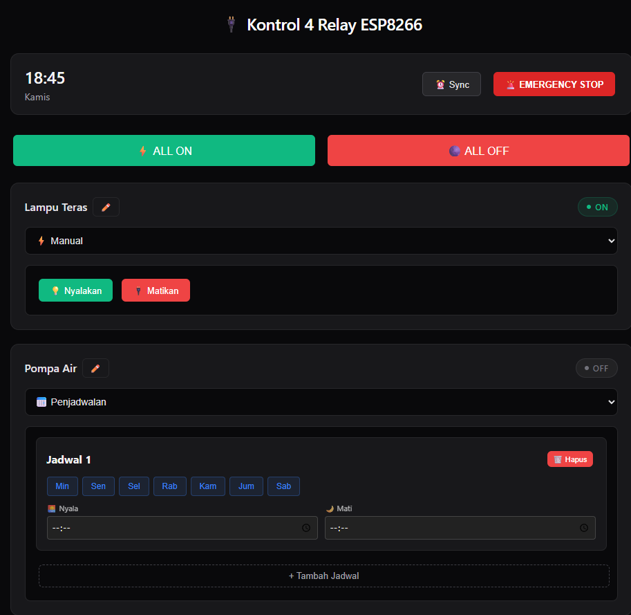
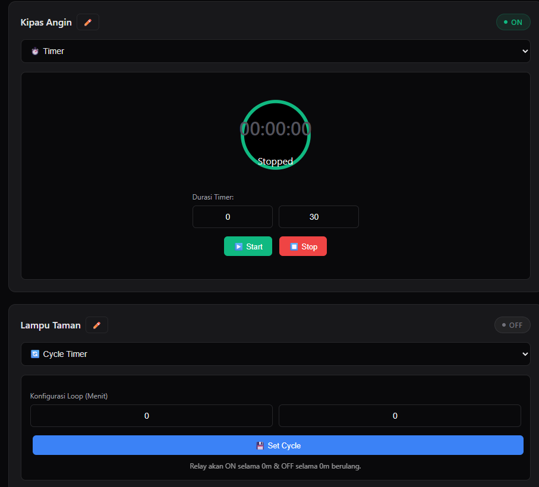
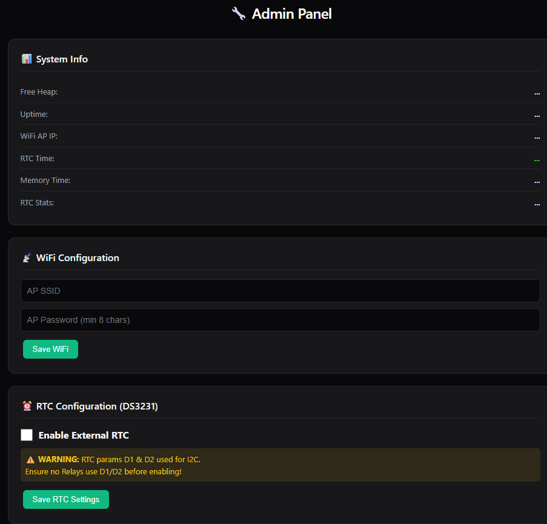
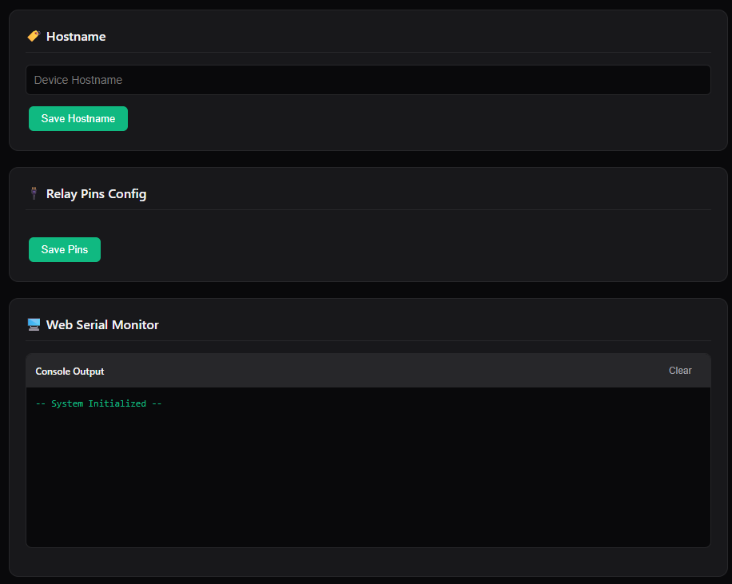

  
  
   
   

  # 🔌 OMNIRELAY ESP8266
  

  

    
    
    
    
    
  

  

    Sebuah sistem otomasi pintar berbasis ESP8266 untuk mengontrol 4 channel relay. Dilengkapi <b>Real-Time Web Dashboard</b>, Penjadwalan RTC DS3231, Timer, dan <b>Premium Minimalist Dark Mode</b> yang tertanam sepenuhnya di dalam firmware.
  

## Fitur Utama

<table align="center" width="100%">
  <tr>
    <td width="50%" valign="top">
      <b>Real-Time Sync Dashboard</b> 
      Antarmuka web tanpa <i>lag</i> yang tersinkronisasi instan melalui WebSocket. Latar belakang <i>Deep Dark Zinc</i>.
    </td>
    <td width="50%" valign="top">
      <b>4 Intelligent Modes</b> 
      Mendukung mode kontrol Manual, Schedule (Jadwal RTC), Timer Mundur, dan Cycle (Loop On/Off).
    </td>
  </tr>
  <tr>
    <td width="50%" valign="top">
      <b>Cinematic Light Show</b> 
      Mode <i>testing</i> dengan 19+ pola efek pencahayaan dinamis (Wave, Strobe, Breathing, dll) khusus untuk aktuator lampu.
    </td>
    <td width="50%" valign="top">
      <b>Secure Admin Panel</b> 
      Panel rahasia untuk mengubah konfigurasi WiFi AP, pemetaan Pin (D1-D8), dan akses Web Serial Monitor.
    </td>
  </tr>
  <tr>
    <td width="50%" valign="top">
      <b>Standalone Firmware (PROGMEM)</b> 
      Seluruh HTML, CSS, dan JS dikompilasi utuh ke dalam C++ tanpa memerlukan file SPIFFS/LittleFS eksternal.
    </td>
    <td width="50%" valign="top">
      <b>OTA Firmware Updates</b> 
      Lakukan pembaruan kode <i>firmware</i> <code>.bin</code> langsung melalui browser, tanpa kabel USB.
    </td>
  </tr>
</table>

## 📸 Galeri Sistem

### 1. Manual & Schedule Control
Manajemen relay harian dengan dukungan sinkronisasi RTC (DS3231) untuk eksekusi tanpa koneksi internet.

### 2. Timer & Cycle Configuration
Mode penghitung waktu otomatis dan siklus berulang, sangat cocok untuk penyiraman tanaman hidroponik atau aerasi akuarium.

### 3. Admin Panel - System Status & WiFi
Konfigurasi jaringan dan pemantauan memori <i>heap</i> secara terpusat dan aman.

### 4. Hardware Pin Mapping & Serial Monitor
Ubah pin aktuator secara dinamis langsung dari web, lengkap dengan terminal <i>debugger</i> nirkabel.

## 🚀 Teknologi yang Digunakan

### Frontend (Embedded in Firmware)
- **Styling:** Vanilla CSS3 dengan skema <i>Premium Minimalist Dark Mode</i>.
- **Typography:** Inter (Sans-serif modern).
- **Interactivity:** Vanilla JavaScript dengan WebSocket API terintegrasi.

### IoT & Firmware (C++ / ESP8266)
- **Microcontroller:** ESP8266 (NodeMCU / Wemos D1 Mini)
- **Language:** C++ (Arduino Framework)
- **Hardware Integration:**
  - 4-Channel Relay Module (Active Low / High)
  - RTC DS3231 Module (I2C: `SDA=D2`, `SCL=D1`)
- **Libraries Used:** 
  - `ESP8266WiFi`, `ESP8266WebServer`, `EEPROM`, `Wire`
  - `WebSocketsServer` by Markus Sattler
  - `RTClib` by Adafruit
  - `ESP8266HTTPUpdateServer`

## 🛠️ Panduan Instalasi & Flashing

1. **Buka Proyek**
   Buka file `relay_otomatis.ino` menggunakan Arduino IDE (pastikan paket board ESP8266 sudah terinstal).
2. **Konfigurasi Variabel**
   Cari blok `// --- KONFIGURASI PENGGUNA ---` di baris teratas kode. Anda bisa mengubah SSID Access Point bawaan, password admin, atau hostname di sini.
3. **Compile & Upload**
   Sambungkan ESP8266, pilih port USB yang sesuai, lalu *Upload* kode.
4. **Hubungkan & Akses**
   - Hubungkan WiFi laptop/HP ke SSID ESP8266 (Contoh: `ESP8266_Relay`).
   - Buka browser dan akses **`http://192.168.4.1/`** untuk Dashboard Utama.
   - Buka **`http://192.168.4.1/admin`** untuk Admin Panel (User: `admin`, Pass: `admin123`).

  

